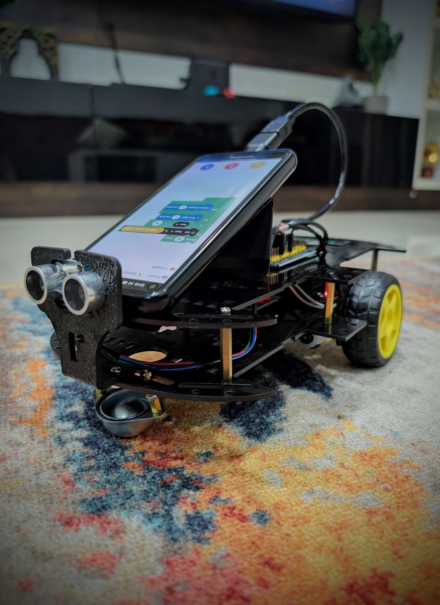
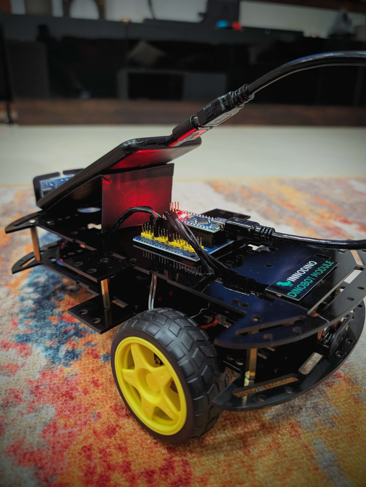
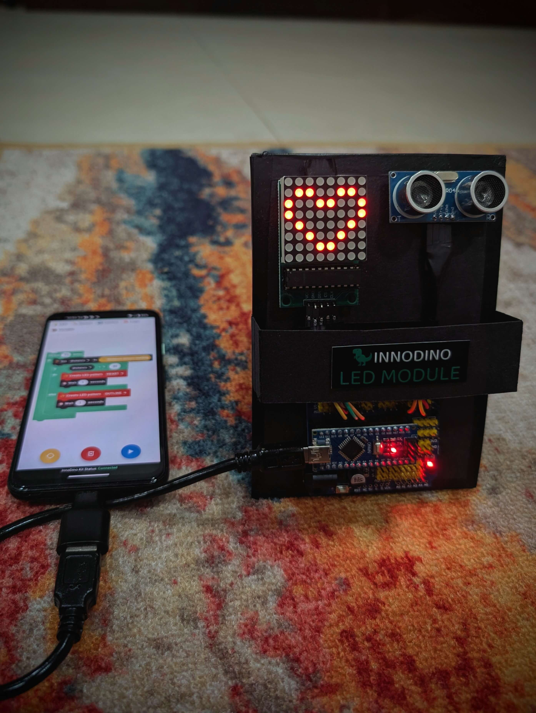
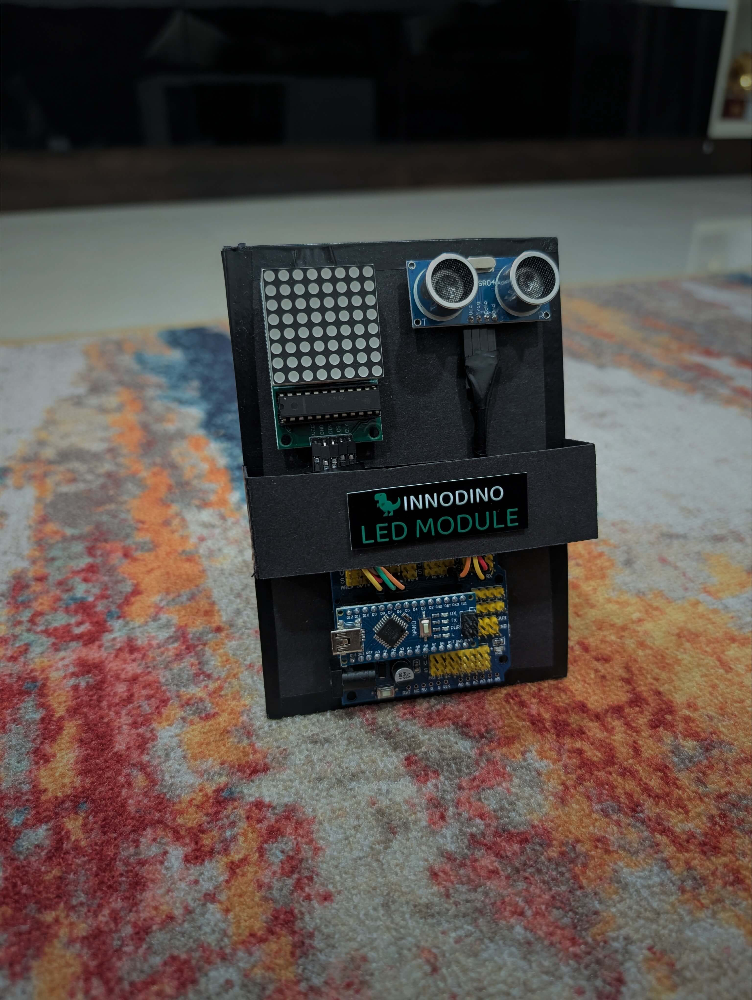
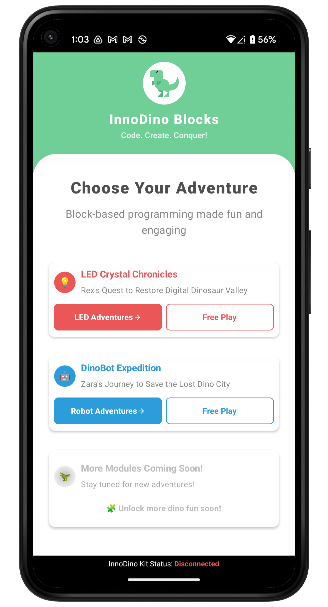
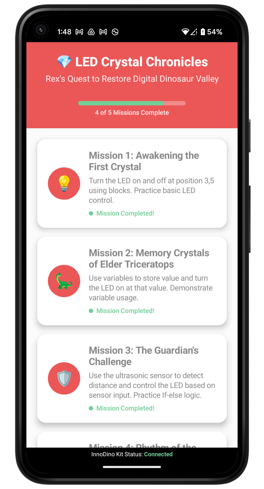
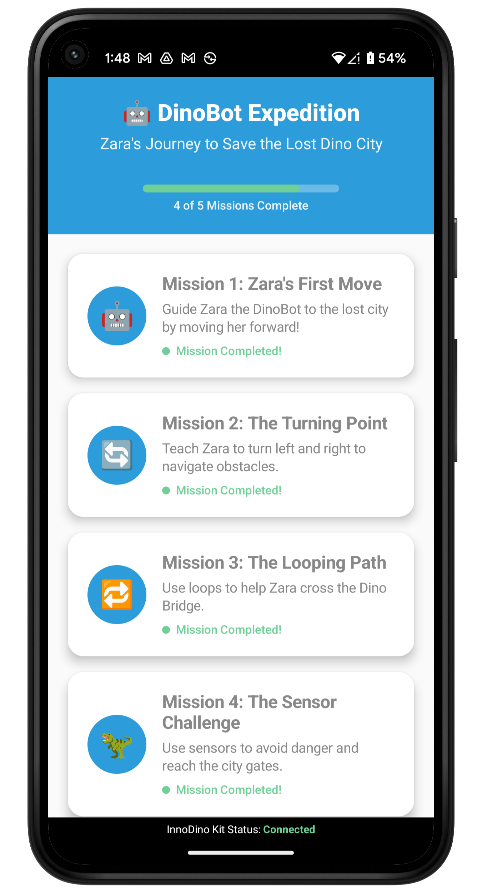
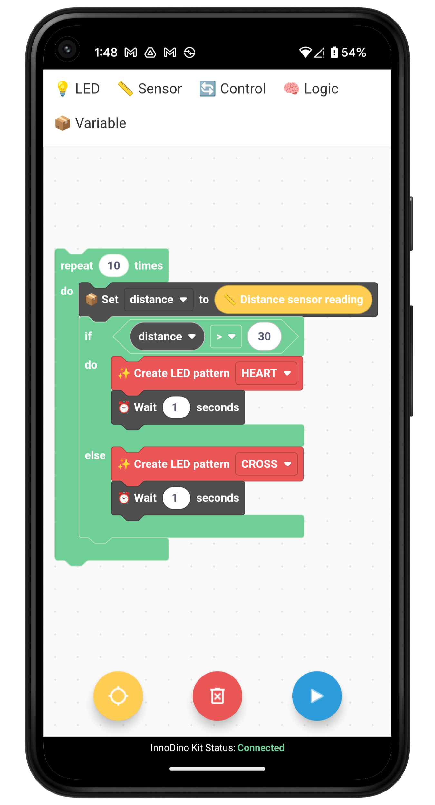
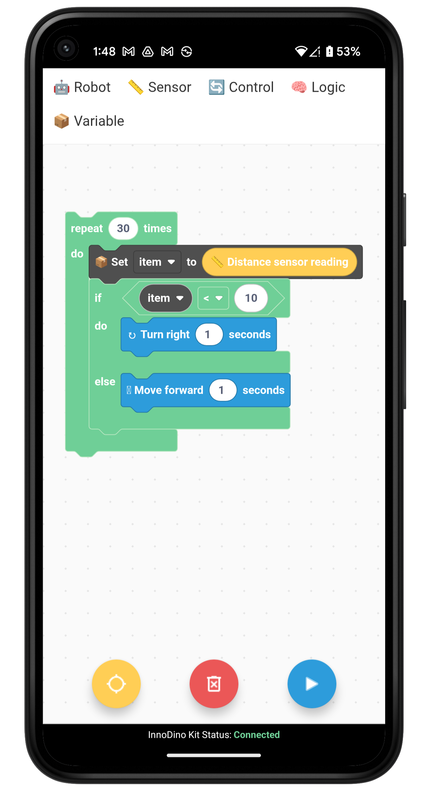
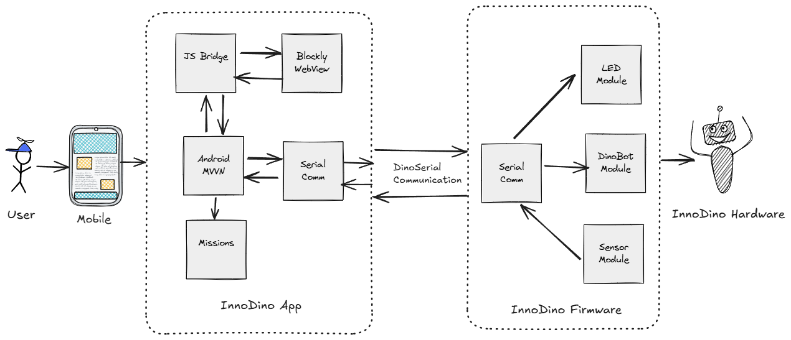

# 🦖 InnoDino

**Ultra-affordable, offline-first robotics learning platform for every child, everywhere.**

## ✨ What is InnoDino?

InnoDino makes robotics and coding accessible through:
- 💰 **Ultra-affordable** modular hardware kits
- 📱 **Mobile app** with visual block programming (no PC needed)
- 🌐 **Offline-first** - works without internet
- 🧩 **Modular design** - start small, expand as you grow

> 🌐 **Learn more at [breejesh.github.io/innodino](https://breejesh.github.io/innodino/)** - Explore kits, curriculum, and community resources

## 🎬 See InnoDino in Action

*See InnoDino's intuitive block-based programming in action!*

## 📸 Gallery

    
    
    
    

    
    
    
    
    

## 🚀 Quick Start

1. **Choose your module**: LED Matrix or DinoBot
2. **Download the mobile app** (Android)
3. **Program with blocks** - drag, drop, create!
4. **Connect via USB** and watch your code come to life

## 📚 Documentation

### **Modules**
- 💡 [LED Module Guide](innodino_blocks_android/LED%20Module.md) - Learn with lights and animation
- 🤖 [DinoBot Module Guide](innodino_blocks_android/DinoBot%20Module.md) - Build and program your robot

### **Software & Development**
- 📡 [DinoSerial Protocol](innodino_blocks_android/DinoSerial%20Protocol.md) - Communication protocol
- 📱 [Android App README](innodino_blocks_android/README.md) - Mobile app development
- 🌐 [Website README](innodino-labs-spa/README.md) - Product Website

### **System Design**

## 🎯 For Educators

- **K-12 ready** - Age-appropriate progression
- **Curriculum included** - Story-driven learning adventures
- **Offline capable** - Perfect for any classroom setting
- **Open source** - Customize and extend freely

## 📄 License

Licensed under GNU AGPL v3.0 - see [LICENSE](LICENSE) for details.
- ✅ Free for educational and non-commercial use
- 💼 Commercial licensing available

---

**🦖 Bringing real robotics and coding to every child, everywhere.**
